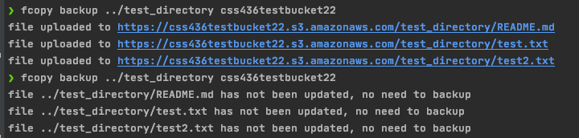
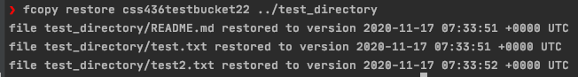

# fcopy

This CLI application recursively traverses the files of a local directory and makes a backup to the cloud.
Backups are stored on buckets in AWS's Simple Storage Service (S3), which are accessed using the user's locally exported AWS credentials.


### Tools Used

* [AWS S3 SDK for Golang](https://docs.aws.amazon.com/sdk-for-go/api/service/s3/)
* [Cobra](https://github.com/spf13/cobra)


## Setup

0 ) Set up and configure your AWS credentials. See instructions [here](https://docs.aws.amazon.com/cli/latest/userguide/cli-configure-files.html).

1 ) Download and install Golang. See instructions [here](xhttps://golang.org/doc/install).

2 ) Run the following command:

```
go install github.com/hollowsunsets/fcopy
```

3 ) Export the AWS region that you use to create S3 buckets:
```
export AWS_REGION=us-east-1
```


## Usage

```
fcopy backup <directory_name> <bucket_name>
fcopy backup --directory <directory_name> --bucket <bucket_name> 
```



```
fcopy restore <bucket_name> <directory_name>
fcopy restore --directory <directory_name> --bucket <bucket_name 
```




## Notes

* If you attempt to make a backup to an S3 bucket that does not appear to exist, a new S3 bucket with that bucket name will be created for you.
* If you attempt to restore from an S3 bucket to a local directory that does not exist, a new directory will be created for you.